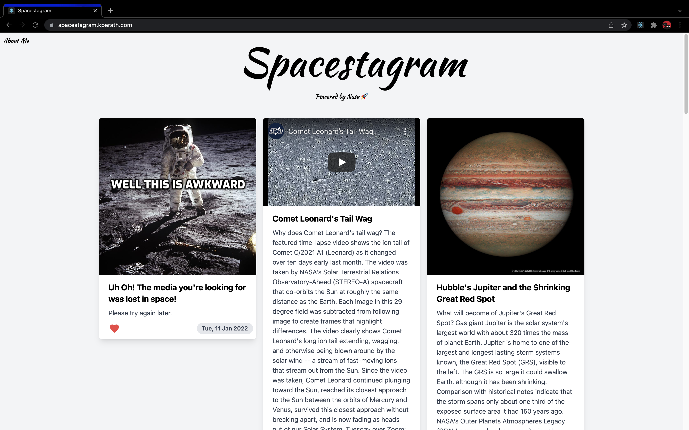
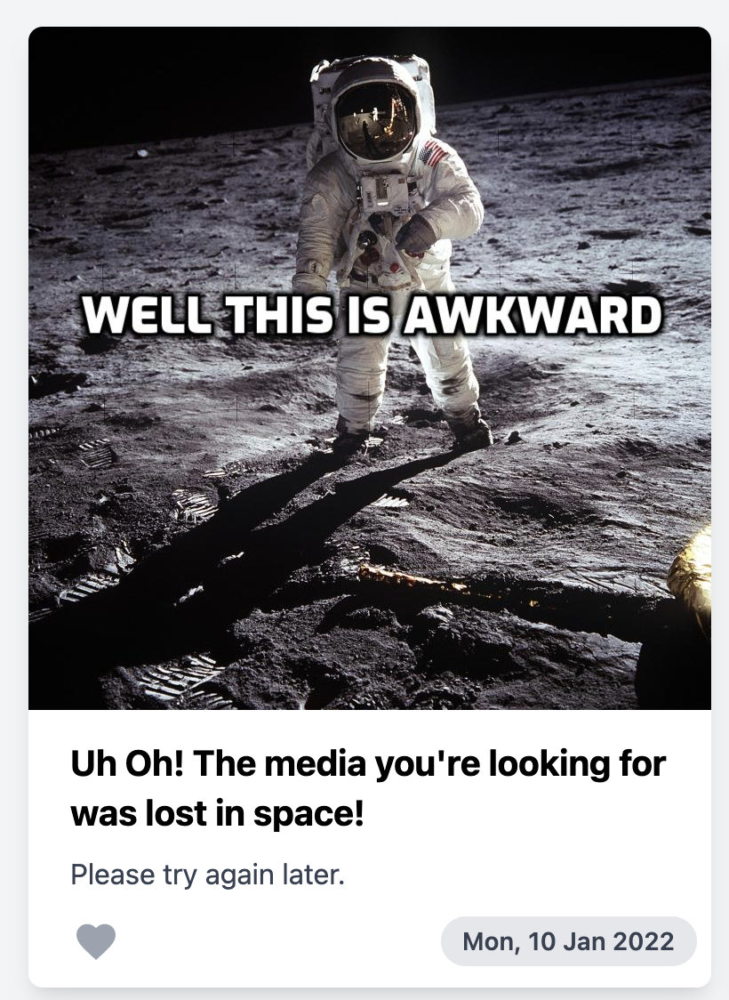

# Spacestagram 🚀

Note: see `old-master` branch to see original commits I did in case it looks like I did the project in a matter of minutes (this is the rebased version)

### View it at: https://spacestagram.kperath.com

    

Built with: React, Typescript, Tailwind CSS and Nasa’s APOD API

#### Features:

- [x] Save likes if the user leaves or reloads the page
- [x] Animate the “like” action (might we suggest a heart?)
- [x] Infinite scroll
- [x] Video support (since I learned not all APODs would be images)
- [x] Responsive to small screens

Improvements I could make:

- [ ] tests
- [ ] mock API data

This is what you'll see if the API fails to retrieve the image:

    

